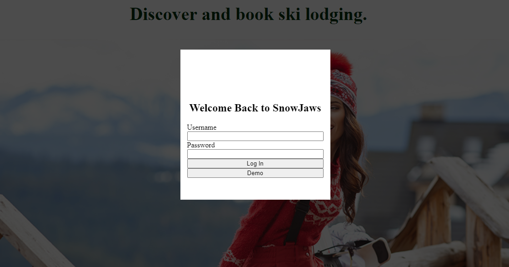

# SnowJaws

Snowjaws is a clone of HipCamp. The Difference is it was designed to book and review Ski Resorts instead of Campsites. There are multi category features that allow users to swap between resorts based on time of the year or preferences between skiing and boarding. 

# Features

## 1. Login Page with preconfigured Demo user Login

  

## 2. Spot Page to Discover places to Ski

  

## 3. Review Any Resort

  

## 4. Clickable Spots for easy access

  

## 5. Categories to find matching Resorts

  

# Conclusion

I really enjoyed making this clone, It easy to navigate through. This was my first project with introduction to React and Redux. I'm happy with the end result and am looking forward to tinkering with it more.
